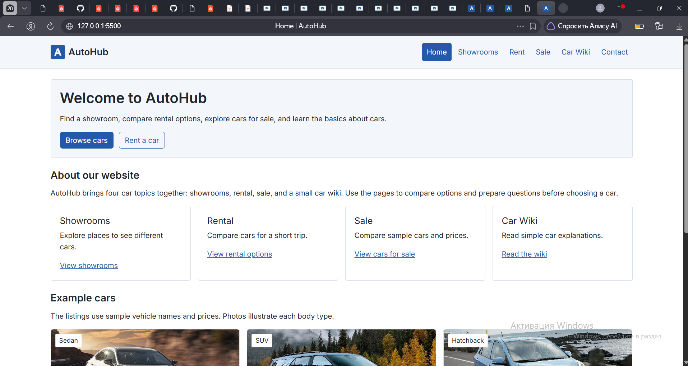
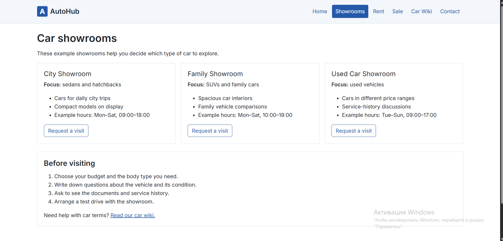
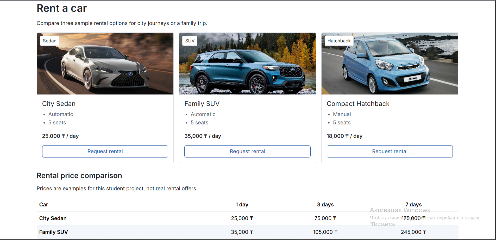
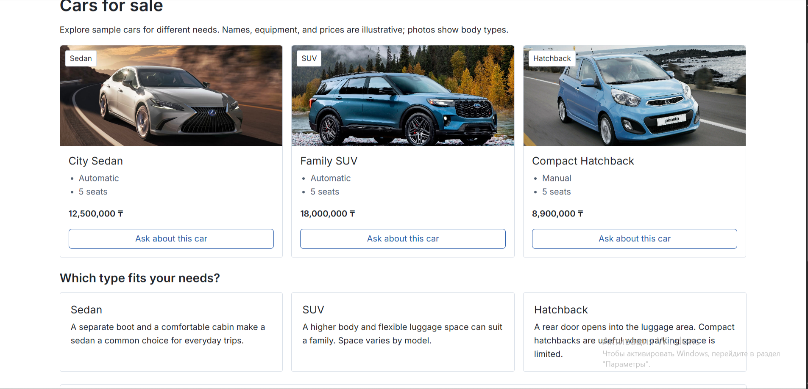
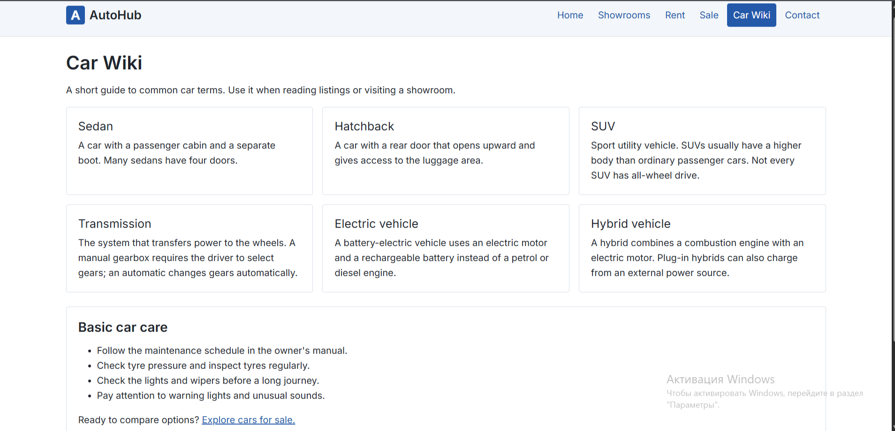

# AutoHub

## Topic

Car Websites: showrooms, rent, sale, wiki.

## Group members

- Askar kairatbek
- Tolbasy Aliakbar
- Yeskermes Alisher

## Project description

AutoHub is a responsive multi-page website about cars.
It includes Home, Showrooms, Rent, Sale, Car Wiki, and Contact pages.
Users can browse example cars, compare rental prices, and read
basic information about cars.

## Features implemented

- Navigation menu, logo, header, main content, and footer on every page.
- Car cards, images, lists, rental pricing table, and contact form.
- External CSS with variables, hover and focus states, and nth-child.
- Flexbox, CSS Grid, and relative/absolute positioning.
- Responsive layouts using media queries and Bootstrap grid.
- Bootstrap spacing, text alignment, buttons, and containers.
- Custom font and lazy-loaded car images.

## Technologies used

- HTML5
- CSS3
- Bootstrap 5.3.3

## Individual contribution

### Askar Kairatbek

Worked on the Home and Showrooms pages.
Implemented the header, logo, navigation menu, and Flexbox layout.

**Home page:**

**Showrooms page:**

### Tolbasy Aliakbar

Worked on the Rent and Sale pages.
Implemented car cards, the rental pricing table, Bootstrap grid,
and relative/absolute positioning for car labels.

**Rent page:**

**Sale page:**

### Yeskermes Alisher

Worked on the Car Wiki and Contact pages.
Implemented CSS Grid, the HTML contact form,
responsive media queries, and README documentation.

**Car Wiki page:**

**Contact page:**

## Published website

